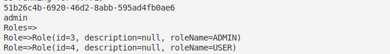
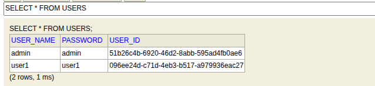
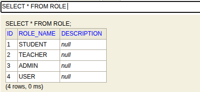
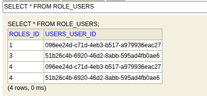

# Rapport TP - ORM JPA Hibernate Spring Data - Partie 3

## Gestion des Utilisateurs et Rôles avec Relations Many-to-Many

---

## Table des Matières

1. [Introduction](#introduction)
2. [Architecture du Projet](#architecture-du-projet)
3. [Entités JPA et Relations](#entités-jpa-et-relations)
4. [Repositories Spring Data](#repositories-spring-data)
5. [Services et Logique Métier](#services-et-logique-métier)
6. [Configuration et Application Principal](#configuration-et-application-principal)
7. [Annotations Utilisées](#annotations-utilisées)
8. [Fonctionnalités Implémentées](#fonctionnalités-implémentées)
9. [Tests et Validation](#tests-et-validation)
10. [Conclusion](#conclusion)

---

## 1. Introduction

Ce projet implémente un système de gestion d'utilisateurs et de rôles utilisant Spring Boot, JPA/Hibernate et Spring Data. Il démontre l'utilisation d'une relation **Many-to-Many** entre les entités `User` et `Role`, ainsi que les bonnes pratiques du développement avec le framework Spring.

### Technologies Utilisées

- **Spring Boot 3.4.4** - Framework principal
- **JPA (Jakarta Persistence API)** - Spécification ORM
- **Hibernate** - Implémentation JPA
- **Spring Data JPA** - Couche d'abstraction pour les repositories
- **H2 Database** - Base de données en mémoire pour les tests
- **Lombok** - Réduction du code boilerplate
- **Maven** - Gestionnaire de dépendances

---

## 2. Architecture du Projet

Le projet suit l'architecture en couches typique d'une application Spring Boot :

```
src/main/java/com/spring/Roles/
├── RolesApplication.java          # Point d'entrée de l'application
├── entities/                      # Couche d'entités JPA
│   ├── User.java
│   └── Role.java
├── repositories/                  # Couche d'accès aux données
│   ├── UserRepository.java
│   └── RoleRepository.java
└── service/                      # Couche de logique métier
    ├── UserService.java
    └── UserServiceImpl.java
```

---

## 3. Entités JPA et Relations

### 3.1 Entité User

```java
@Entity
@Table(name="USERS")
@Data
@AllArgsConstructor
@NoArgsConstructor
public class User {
    @Id
    private String userId;
  
    @Column(name="user_name", unique=true, length=20)
    private String username;
  
    private String password;
  
    @ManyToMany(mappedBy = "users", fetch = FetchType.EAGER)
    private List<Role> roles = new ArrayList<>();
}
```

**Explications des annotations :**

- `@Entity` : Marque la classe comme une entité JPA persistante
- `@Table(name="USERS")` : Spécifie le nom de la table en base de données
- `@Id` : Définit la clé primaire
- `@Column` : Configure les propriétés de la colonne (contraintes, taille)
- `@ManyToMany(mappedBy = "users")` : Définit la relation Many-to-Many côté inverse
- `@Data, @AllArgsConstructor, @NoArgsConstructor` : Annotations Lombok pour générer getters/setters/constructeurs

### 3.2 Entité Role

```java
@Entity
@Data 
@AllArgsConstructor 
@NoArgsConstructor
public class Role {
    @Id 
    @GeneratedValue(strategy = GenerationType.IDENTITY)
    private Long id;
  
    private String description;
  
    @Column(length=20, unique=true)
    private String roleName;
  
    @ManyToMany(fetch = FetchType.EAGER)
    @ToString.Exclude
    private List<User> users = new ArrayList<>();
}
```

**Explications des annotations :**

- `@GeneratedValue(strategy = GenerationType.IDENTITY)` : Auto-incrémentation de l'ID
- `@ManyToMany(fetch = FetchType.EAGER)` : Côté propriétaire de la relation
- `@ToString.Exclude` : Évite les boucles infinies lors de l'affichage

### 3.3 Relation Many-to-Many

La relation Many-to-Many entre `User` et `Role` crée automatiquement une table de jointure :

```sql
-- Table générée automatiquement par Hibernate
CREATE TABLE role_users (
    roles_id BIGINT,
    users_user_id VARCHAR(255),
    FOREIGN KEY (roles_id) REFERENCES role(id),
    FOREIGN KEY (users_user_id) REFERENCES users(user_id)
);
```

---

## 4. Repositories Spring Data

### 4.1 UserRepository

```java
@Repository
public interface UserRepository extends JpaRepository<User, String> {
    User findByUsername(String username);
}
```

### 4.2 RoleRepository

```java
@Repository
public interface RoleRepository extends JpaRepository<Role, Long> {
    Role findByRoleName(String roleName);
}
```

**Avantages de Spring Data JPA :**

- **Méthodes CRUD automatiques** : `save()`, `findById()`, `findAll()`, `delete()`
- **Query Methods** : Génération automatique de requêtes basées sur le nom de la méthode
- **Pas de code SQL** : Spring Data génère les requêtes automatiquement

---

## 5. Services et Logique Métier

### 5.1 Interface UserService

```java
public interface UserService {
    User addNewUser(User user);
    Role addNewRole(Role role);
    User fetchUserByUsername(String userName);
    Role fetchRoleByRoleName(String roleName);
    void addRoleToUser(String username, String roleName);
    User authenticate(String username, String password);
}
```

### 5.2 Implémentation UserServiceImpl

```java
@Service
@Transactional
@AllArgsConstructor
public class UserServiceImpl implements UserService {
    private UserRepository userRepository;
    private RoleRepository roleRepository;

    @Override
    public User addNewUser(User user) {
        user.setUserId(UUID.randomUUID().toString());
        return userRepository.save(user);
    }

    @Override
    public void addRoleToUser(String username, String roleName) {
        User user = fetchUserByUsername(username);
        Role role = fetchRoleByRoleName(roleName);
    
        if(user != null && role != null) {
            user.getRoles().add(role);
            role.getUsers().add(user);
            userRepository.save(user);
        }
    }

    @Override
    public User authenticate(String username, String password) {
        User user = userRepository.findByUsername(username);
        if(user == null) throw new RuntimeException("Bad credentials");
        if(user.getPassword().equals(password)){
            return user;
        }
        throw new RuntimeException("Bad credentials");
    }
}
```

**Concepts importants :**

- `@Service` : Marque la classe comme un service Spring
- `@Transactional` : Gestion automatique des transactions
- **Injection de dépendances** : Les repositories sont injectés via le constructeur
- **Gestion des relations** : Mise à jour bidirectionnelle des associations

---

## 6. Configuration et Application Principal

### 6.1 Point d'entrée de l'application

```java
@SpringBootApplication
public class RolesApplication {
    public static void main(String[] args) {
        SpringApplication.run(RolesApplication.class, args);
    }

    @Bean
    CommandLineRunner start(UserService userService) {
        return (args) -> {
            // Création des utilisateurs
            User u1 = new User();
            u1.setUsername("admin");
            u1.setPassword("admin");
            userService.addNewUser(u1);

            User u2 = new User();
            u2.setUsername("user1");
            u2.setPassword("user1");
            userService.addNewUser(u2);

            // Création des rôles
            Stream.of("STUDENT", "TEACHER", "ADMIN", "USER").forEach(r -> {
                Role r1 = new Role();
                r1.setRoleName(r);
                userService.addNewRole(r1);
            });

            // Attribution des rôles
            userService.addRoleToUser("user1", "STUDENT");
            userService.addRoleToUser("user1", "USER");
            userService.addRoleToUser("admin", "ADMIN");
            userService.addRoleToUser("admin", "USER");

            // Test d'authentification
            try {
                User user = userService.authenticate("admin", "admin");
                System.out.println("User ID: " + user.getUserId());
                System.out.println("Username: " + user.getUsername());
                System.out.println("Roles:");
                user.getRoles().forEach(role -> {
                    System.out.println("Role: " + role.getRoleName());
                });
            } catch(Exception e) {
                e.printStackTrace();
            }
        };
    }
}
```

### 6.2 Configuration application.properties

```properties
# Configuration H2 Database
spring.datasource.url=jdbc:h2:mem:users-db
spring.datasource.driverClassName=org.h2.Driver
spring.datasource.username=sa
spring.datasource.password=

# Configuration JPA/Hibernate
spring.jpa.database-platform=org.hibernate.dialect.H2Dialect
spring.jpa.hibernate.ddl-auto=create
spring.jpa.show-sql=true
spring.jpa.properties.hibernate.format_sql=true

# H2 Console
spring.h2.console.enabled=true
spring.h2.console.path=/h2-console

# Configuration serveur
server.port=8081
```

---

## 7. Annotations Utilisées

### 7.1 Annotations JPA/Hibernate

| Annotation           | Description                           | Exemple d'utilisation                                   |
| -------------------- | ------------------------------------- | ------------------------------------------------------- |
| `@Entity`          | Marque une classe comme entité JPA   | `@Entity public class User`                           |
| `@Table`           | Configure le nom de la table          | `@Table(name="USERS")`                                |
| `@Id`              | Définit la clé primaire             | `@Id private String userId`                           |
| `@GeneratedValue`  | Auto-génération de la clé primaire | `@GeneratedValue(strategy = GenerationType.IDENTITY)` |
| `@Column`          | Configure les propriétés de colonne | `@Column(unique=true, length=20)`                     |
| `@ManyToMany`      | Relation Many-to-Many                 | `@ManyToMany(mappedBy = "users")`                     |
| `@FetchType.EAGER` | Chargement immédiat des relations    | `fetch = FetchType.EAGER`                             |

### 7.2 Annotations Spring

| Annotation                 | Description                          | Utilisation          |
| -------------------------- | ------------------------------------ | -------------------- |
| `@SpringBootApplication` | Configuration principale Spring Boot | Classe principale    |
| `@Service`               | Marque une classe de service         | Couche métier       |
| `@Repository`            | Marque une classe de repository      | Couche données      |
| `@Transactional`         | Gestion des transactions             | Méthodes de service |
| `@Bean`                  | Définit un bean Spring              | Configuration        |
| `@AllArgsConstructor`    | Injection par constructeur (Lombok)  | Services             |

### 7.3 Annotations Lombok

| Annotation              | Description                                       | Code généré     |
| ----------------------- | ------------------------------------------------- | ------------------ |
| `@Data`               | Génère getters/setters/toString/equals/hashCode | Entités           |
| `@AllArgsConstructor` | Génère constructeur avec tous les paramètres   | Services           |
| `@NoArgsConstructor`  | Génère constructeur sans paramètres            | Entités JPA       |
| `@ToString.Exclude`   | Exclut un champ du toString()                     | Évite les boucles |

---

## 8. Fonctionnalités Implémentées

### 8.1 Gestion des Utilisateurs

- ✅ **Création d'utilisateurs** avec ID UUID généré automatiquement
- ✅ **Recherche par nom d'utilisateur**
- ✅ **Authentification** avec validation des credentials

### 8.2 Gestion des Rôles

- ✅ **Création de rôles** avec noms uniques
- ✅ **Recherche par nom de rôle**
- ✅ **Attribution de rôles aux utilisateurs**

### 8.3 Relations Many-to-Many

- ✅ **Association bidirectionnelle** User ↔ Role
- ✅ **Gestion automatique de la table de jointure**
- ✅ **Chargement eager** des relations

### 8.4 Fonctionnalités Techniques

- ✅ **Base de données H2 en mémoire**
- ✅ **Console H2** accessible via `/h2-console`
- ✅ **Génération automatique du schéma**
- ✅ **Logging SQL** pour le debug

---

## 9. Tests et Validation

### 9.1 Données de Test Créées

```java
// Utilisateurs créés
User admin = {userId: "UUID", username: "admin", password: "admin"}
User user1 = {userId: "UUID", username: "user1", password: "user1"}

// Rôles créés
Role[] roles = {"STUDENT", "TEACHER", "ADMIN", "USER"}

// Associations
admin → [ADMIN, USER]
user1 → [STUDENT, USER]
```

### 9.2 Sortie de l'Application

```
User ID: 51b26c4b-6920-46d2-8abb-595ad4fb0ae6
Username: admin
Roles:
Role: ADMIN
Role: USER
```



### 9.3 Accès à la Console H2

- **URL** : http://localhost:8081/h2-console
- **JDBC URL** : `jdbc:h2:mem:users-db`
- **Username** : `sa`
- **Password** : (vide)




